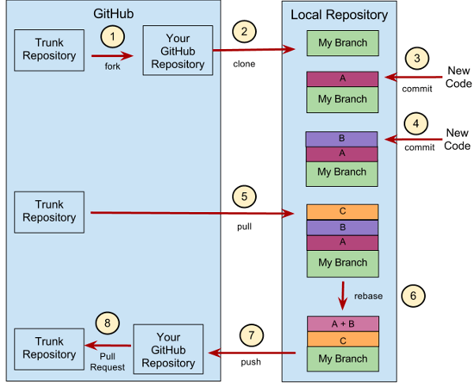

## 开发流程

建议按下图的流程来使用 Git （可使用 gtm 工具来快速实现）



## 所有的开发都必须基于 Issue
必须从最新的主分支或者目标功能分支切换出新的本地个人开发分支进行

### 请安装 pre-commit 以保证代码提交前符合基本的开发规范

### 单据类型

根据单据类型，可分为以下几种。创建单据时可根据实际开发内容进行选择。

单据类型虽然并不影响开发流程，但后续会作为研效的评判依据，因此请准确填写。如果实在拿不准，可以遵循一个简单的原则：问题修复用 `fix`，其他用 `feat`

| 类型     | 中文       | Emoji | 说明                                                         |
| -------- | ---------- | ----- | ------------------------------------------------------------ |
| feat     | 特性       | ✨     | A new feature. Correlates with MINOR in SemVer               |
| fix      | 修复       | 🐛     | A bug fix. Correlates with PATCH in SemVer                   |
| docs     | 文档       | 📚     | Documentation only changes                                   |
| style    | (代码)样式 | 💎     | Changes that do not affect the meaning of the code (white-space, formatting, etc) |
| refactor | 重构       | 📦     | A code change that neither fixes a bug nor adds a feature    |
| perf     | 性能优化   | 🚀     | A code change that improves performance                      |
| test     | 测试       | 🚨     | Adding missing or correcting existing tests                  |
| chore    | 琐事       | ♻️     | Changes to the build process or auxiliary tools and libraries such as documentation generation |


### 开发前准备
- 使用命令 gtm create 来创建或关联 Issue，此命令完成后会在 upstream 仓库中创建对应的 Branch 和 Pull Request
  ```
  gtm c
  ```
- 按照提示执行以下命令开始开发
    - 同步上游仓库分支
      ```
      git fetch upstream
      ```
    - 切换到功能开发分支，以 `feat/ipv6` 为例
      ```
      git checkout feat/ipv6 
      ```
    - 推送分支到个人仓库
      ```
      git push --set-upstream origin feat/ipv6
      ```

### 现在可以开始 coding 了
- 提交代码时，commit message 注意按规范进行书写

### 完成开发后
- 假如你本次开发有多个 commits，建议使用 `rebase` 来整理你的commits，原则上一个 Pull Request 只对应一条 commit记录
   ```
   # git log --oneline 查询提交记录并找到需要 rebase 的目标 commit-id
   git rebase -i [commit-id]
   ```
- 将本地分支推送到 origin 仓库
   ```
   git push
   ```
- 使用 `gtm  pr` 创建 origin -> upstream 的 Pull Request
   ```
   gtm pr 
   ```